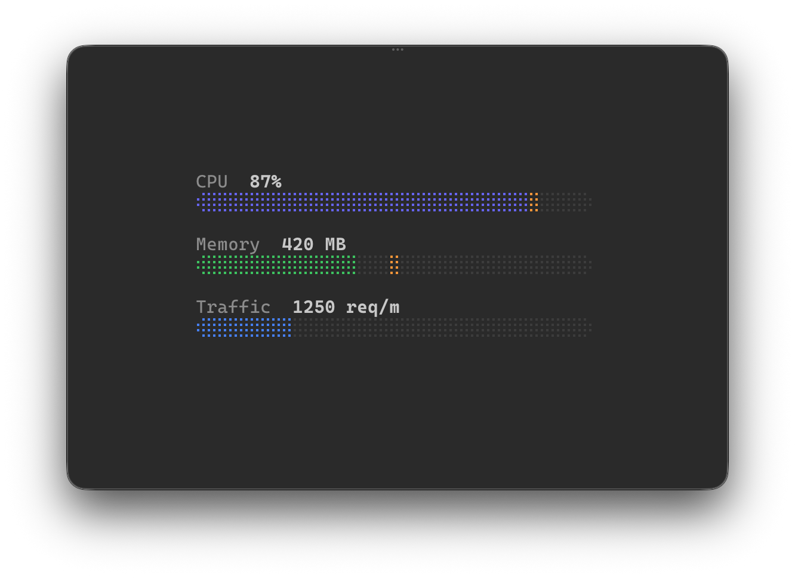

# ratatui-braille-bar

[](https://github.com/penso/ratatui-braille-bar/actions/workflows/ci.yml)
[](https://crates.io/crates/ratatui-braille-bar)
[](LICENSE.md)

Once-style braille progress bars for [ratatui](https://ratatui.rs).

Inspired by [Basecamp's Once](https://github.com/basecamp/once) dashboard meters.



## Features

- Braille characters with rounded end caps (`⢾` / `⡷`)
- Optional peak marker (e.g. max CPU over a sliding window)
- Three visual states: filled, peak, empty
- Auto-sizes to `area.width` — no manual width needed
- Implements `ratatui::Widget`
- Also exposes `into_line()` for composing into larger widgets
- `BrailleSpinner` — random braille dot pattern for indeterminate/loading states

## Usage

```rust
use ratatui::style::Color;
use ratatui_braille_bar::BrailleBar;

// As a Widget (auto-sizes to area)
frame.render_widget(
    BrailleBar::new(62.0, 100.0)
        .peak(78.0)
        .fill_color(Color::Rgb(99, 102, 241)),
    area,
);

// As a Line (for composing)
let line = BrailleBar::new(0.42, 1.0)
    .fill_color(Color::Green)
    .into_line(30);

// Random braille spinner (re-render each frame for animation)
use ratatui_braille_bar::BrailleSpinner;
frame.render_widget(
    BrailleSpinner::new().color(Color::Rgb(99, 102, 241)),
    area,
);
```

## Run the example

```sh
cargo run --example dashboard
```

## License

MIT
